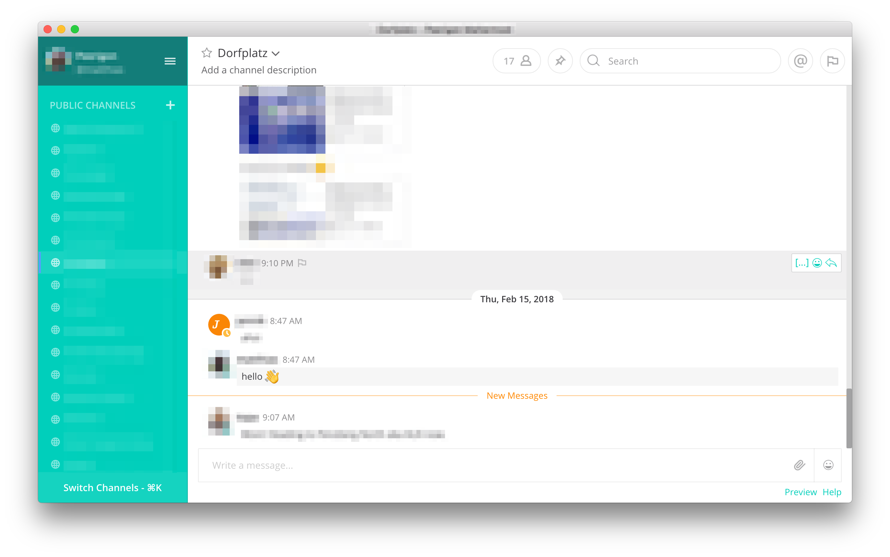
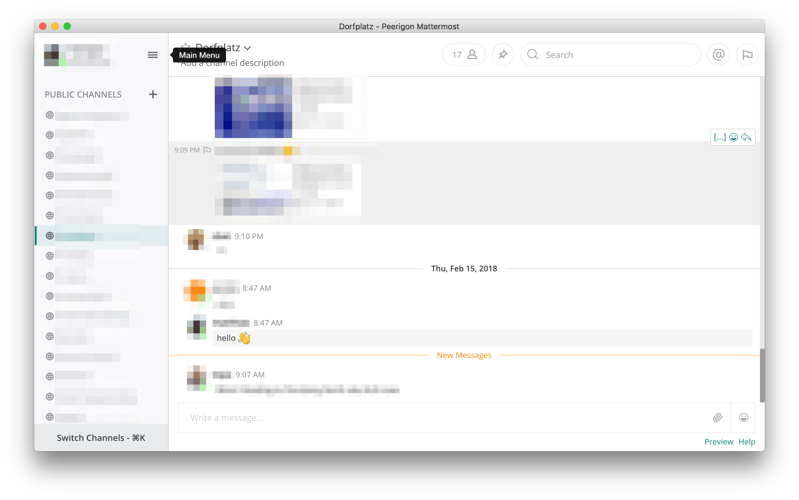

# The Peerigon Mattermost Theme

* Open Mattermost
* Account Settings
* Display
* Custom Theme
* Copy and paste the [share theme colors](https://github.com/peerigon/mattermost-theme/blob/master/peerigon.json).
* Save

Please share your improvements :)

# Screenshots

### Peerigon theme

### Peerigon light spinach theme

